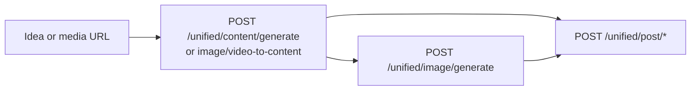

The AI content endpoints turn **ideas**, **text**, or **media URLs** into draft social copy and images. They use the same generators as the Postsiva app, WhatsApp agent, MCP, and GPT Actions.

<Note>
  None of these endpoints publish to social networks. Chain with [Posting](/apis/posting) (`POST /unified/post/*`) or the MCP `publish` tool when you are ready to go live.
</Note>

## Authentication

All routes require a workspace API key or JWT session.

```
X-API-Key: psk_live_YOUR_KEY
Content-Type: application/json
```

Every endpoint also requires **`workspace_id`** as a query parameter (UUID). With an API key, the key's workspace is authoritative — `workspace_id` must match if you send both.

AI generation consumes **AI credits** on your plan (`generation_long` = 2 credits, `image_generate` = 5 credits per platform run).

---

## Idea to content

Generate platform-specific post copy from a topic or idea. Mirrors MCP tool **`idea_to_content`**.

### `POST /unified/content/generate`

**Query parameters**

| Parameter | Type | Required | Description |
|-----------|------|----------|-------------|
| `workspace_id` | UUID | Yes | Workspace to generate for |

**Request body**

| Field | Type | Required | Description |
|-------|------|----------|-------------|
| `idea` | string | Yes* | Post topic or idea used when no per-platform override exists |
| `platforms` | string[] | Yes | One or more platforms, or `["all"]` for unified output |
| `idea_by_platform` | object | No | Per-platform idea overrides, e.g. `{"linkedin": "...", "instagram": "..."}` |
| `user_requirements` | string | No | Tone, length, audience, or other constraints |
| `page_id` | string | No | Facebook Page ID or LinkedIn organization ID when org/page context is needed |
| `target_platforms` | string[] | No | When `platforms` is `["all"]`, narrows which platforms the unified agent targets |

\* `idea` can be empty if every requested platform has an entry in `idea_by_platform`.

**Supported platforms:** `linkedin`, `instagram`, `facebook`, `bluesky`, `threads`, `tiktok`, `youtube`, `pinterest`, or `all`.

<CodeGroup>

```bash cURL
curl -X POST "https://backend.postsiva.com/unified/content/generate?workspace_id=YOUR_WORKSPACE_UUID" \
  -H "Content-Type: application/json" \
  -H "X-API-Key: psk_live_YOUR_KEY" \
  -d '{
    "idea": "5 tips for remote team productivity",
    "platforms": ["linkedin", "threads"],
    "user_requirements": "Professional tone, include a question at the end"
  }'
```

```javascript JavaScript
const workspaceId = "YOUR_WORKSPACE_UUID";
const res = await fetch(
  `https://backend.postsiva.com/unified/content/generate?workspace_id=${workspaceId}`,
  {
    method: "POST",
    headers: {
      "Content-Type": "application/json",
      "X-API-Key": "psk_live_YOUR_KEY",
    },
    body: JSON.stringify({
      idea: "5 tips for remote team productivity",
      platforms: ["linkedin", "threads"],
      user_requirements: "Professional tone, include a question at the end",
    }),
  }
);
const data = await res.json();
```

```python Python
import requests

workspace_id = "YOUR_WORKSPACE_UUID"
r = requests.post(
    f"https://backend.postsiva.com/unified/content/generate?workspace_id={workspace_id}",
    headers={"X-API-Key": "psk_live_YOUR_KEY"},
    json={
        "idea": "5 tips for remote team productivity",
        "platforms": ["linkedin", "threads"],
        "user_requirements": "Professional tone, include a question at the end",
    },
)
print(r.json())
```

</CodeGroup>

**Response example**

```json
{
  "success": true,
  "message": null,
  "data": {
    "linkedin": {
      "content": "Remote work thrives when teams...\n\nWhat's your #1 tip for staying productive at home?"
    },
    "threads": {
      "content": "5 remote productivity tips that actually work 🧵\n\n1. Time-block your deep work..."
    }
  },
  "error": null
}
```

<ResponseField name="data" type="object">
  Per-platform keys. Each value is either `{ "content": "..." }` with full post text, or `{ "error": "..." }` on failure for that platform.
</ResponseField>

**Per-platform ideas example**

```json
{
  "idea": "Product launch",
  "platforms": ["linkedin", "instagram"],
  "idea_by_platform": {
    "linkedin": "B2B angle: how our API saves engineering time",
    "instagram": "Visual-first teaser for our new mobile app"
  }
}
```

---

## Content to image

Generate images from post copy. Mirrors MCP tool **`content_to_image`**.

### `POST /unified/image/generate`

**Query parameters**

| Parameter | Type | Required | Description |
|-----------|------|----------|-------------|
| `workspace_id` | UUID | Yes | Workspace UUID |

**Request body**

| Field | Type | Required | Description |
|-------|------|----------|-------------|
| `content` | string | Yes* | Post text to base the image on |
| `platforms` | string[] | Yes | Target platforms or `["all"]` |
| `content_by_platform` | object | No | Per-platform caption overrides |
| `user_requirements` | string | No | Style, mood, or composition hints |
| `page_id` | string | No | LinkedIn org or Facebook Page when required |

\* `content` can be omitted if every platform has `content_by_platform`.

**Supported platforms:** `all`, `linkedin`, `instagram`, `facebook`, `threads`, `tiktok`, `pinterest`, `twitter` (alias `x`), `bluesky`. Platforms run **in parallel**.

<CodeGroup>

```bash cURL
curl -X POST "https://backend.postsiva.com/unified/image/generate?workspace_id=YOUR_WORKSPACE_UUID" \
  -H "Content-Type: application/json" \
  -H "X-API-Key: psk_live_YOUR_KEY" \
  -d '{
    "content": "Minimal flat illustration of a rocket launching from a laptop",
    "platforms": ["linkedin", "instagram"],
    "user_requirements": "Brand colors: indigo and white, no text in image"
  }'
```

```javascript JavaScript
const res = await fetch(
  `https://backend.postsiva.com/unified/image/generate?workspace_id=${workspaceId}`,
  {
    method: "POST",
    headers: {
      "Content-Type": "application/json",
      "X-API-Key": "psk_live_YOUR_KEY",
    },
    body: JSON.stringify({
      content: "Minimal flat illustration of a rocket launching from a laptop",
      platforms: ["linkedin", "instagram"],
      user_requirements: "Brand colors: indigo and white, no text in image",
    }),
  }
);
```

```python Python
r = requests.post(
    f"https://backend.postsiva.com/unified/image/generate?workspace_id={workspace_id}",
    headers={"X-API-Key": "psk_live_YOUR_KEY"},
    json={
        "content": "Minimal flat illustration of a rocket launching from a laptop",
        "platforms": ["linkedin", "instagram"],
        "user_requirements": "Brand colors: indigo and white, no text in image",
    },
)
```

</CodeGroup>

**Response example**

```json
{
  "success": true,
  "message": null,
  "data": {
    "linkedin": {
      "image_url": "https://cdn.postsiva.com/media/abc123.png",
      "media_id": "286fa0a8-0a35-4cd4-a43d-2f7cd61b6242",
      "image_prompt": "Minimal flat illustration..."
    },
    "instagram": {
      "image_url": "https://cdn.postsiva.com/media/def456.png",
      "media_id": "a1b2c3d4-e5f6-7890-abcd-ef1234567890",
      "image_prompt": "Square crop, vibrant..."
    }
  },
  "error": null
}
```

<ResponseField name="media_id" type="UUID">
  Postsiva unified media ID. Pass to `POST /unified/post/image` as `default_image_id` when publishing.
</ResponseField>

---

## Image to content

Generate post copy from a single image URL. Mirrors MCP **`media_to_content`** with `media_type=image`.

### `POST /unified/image-to-content/generate`

**Query parameters**

| Parameter | Type | Required | Description |
|-----------|------|----------|-------------|
| `workspace_id` | UUID | Yes | Workspace UUID |

**Request body**

| Field | Type | Required | Description |
|-------|------|----------|-------------|
| `image_url` | string | Yes | Public HTTPS URL of the image |
| `platform` | string | Yes | One platform or `all` |
| `user_requirements` | string | No | Tone or style instructions |
| `page_id` | string | No | LinkedIn org ID when needed |
| `target_platforms` | string[] | No | When `platform` is `all`, list specific targets |

**Supported platforms:** `linkedin`, `instagram`, `threads`, `tiktok`, `pinterest`, `all`.

<CodeGroup>

```bash cURL
curl -X POST "https://backend.postsiva.com/unified/image-to-content/generate?workspace_id=YOUR_WORKSPACE_UUID" \
  -H "Content-Type: application/json" \
  -H "X-API-Key: psk_live_YOUR_KEY" \
  -d '{
    "image_url": "https://cdn.example.com/product-shot.jpg",
    "platform": "instagram",
    "user_requirements": "Casual tone, include 3 relevant hashtags"
  }'
```

```javascript JavaScript
await fetch(
  `https://backend.postsiva.com/unified/image-to-content/generate?workspace_id=${workspaceId}`,
  {
    method: "POST",
    headers: {
      "Content-Type": "application/json",
      "X-API-Key": "psk_live_YOUR_KEY",
    },
    body: JSON.stringify({
      image_url: "https://cdn.example.com/product-shot.jpg",
      platform: "instagram",
      user_requirements: "Casual tone, include 3 relevant hashtags",
    }),
  }
);
```

```python Python
requests.post(
    f"https://backend.postsiva.com/unified/image-to-content/generate?workspace_id={workspace_id}",
    headers={"X-API-Key": "psk_live_YOUR_KEY"},
    json={
        "image_url": "https://cdn.example.com/product-shot.jpg",
        "platform": "instagram",
        "user_requirements": "Casual tone, include 3 relevant hashtags",
    },
)
```

</CodeGroup>

**Response example**

```json
{
  "success": true,
  "message": null,
  "data": {
    "content": "Meet our newest release — designed for creators on the go ✨\n\n#ProductLaunch #CreatorTools #NewDrop"
  },
  "error": null
}
```

---

## Video to content

Generate post copy from a video URL. Mirrors MCP **`media_to_content`** with `media_type=video`.

### `POST /unified/video-to-content/generate`

**Query parameters**

| Parameter | Type | Required | Description |
|-----------|------|----------|-------------|
| `workspace_id` | UUID | Yes | Workspace UUID |

**Request body**

| Field | Type | Required | Description |
|-------|------|----------|-------------|
| `video_url` | string | Yes | Public HTTPS URL of the video |
| `platform` | string | Yes | Target platform or `all` |
| `user_requirements` | string | No | Tone or format instructions |
| `page_id` | string | No | Reserved for future org context |
| `target_platforms` | string[] | No | When `platform` is `all`, list specific targets |

**Supported platforms:** `linkedin`, `instagram`, `threads`, `tiktok`, `pinterest`, `youtube`, `facebook`, `bluesky`, `all`.

<CodeGroup>

```bash cURL
curl -X POST "https://backend.postsiva.com/unified/video-to-content/generate?workspace_id=YOUR_WORKSPACE_UUID" \
  -H "Content-Type: application/json" \
  -H "X-API-Key: psk_live_YOUR_KEY" \
  -d '{
    "video_url": "https://cdn.example.com/demo.mp4",
    "platform": "linkedin",
    "user_requirements": "Professional, highlight key product benefits"
  }'
```

</CodeGroup>

**Response example**

```json
{
  "success": true,
  "data": {
    "content": "In 60 seconds, see how teams cut reporting time in half..."
  }
}
```

---

## Analyze media (MCP / agent only)

**Describe** an image or video without generating post copy. Available via:

- MCP tool **`analyze_media`**
- GPT Actions **`POST /unified/gpt-actions/analyze_media`**
- Workspace agent chat (`POST /workspace-agent/website/chat`)

There is **no dedicated REST route** for vision-only analysis. Use **`analyze_media`** when you need a neutral description before drafting, and **`media_to_content`** (or the image/video-to-content endpoints above) when you want publish-ready captions.

```json
{
  "url": "https://cdn.example.com/photo.jpg",
  "media_type": "image"
}
```

---

## End-to-end pipeline



**Example flow**

1. `POST /unified/content/generate` — draft LinkedIn + Instagram copy
2. `POST /unified/image/generate` — create images from the LinkedIn caption
3. `POST /unified/post/image` — publish with `default_image_id` from step 2

---

## MCP equivalents

| REST endpoint | MCP tool |
|---------------|----------|
| `POST /unified/content/generate` | `idea_to_content` |
| `POST /unified/image/generate` | `content_to_image` |
| `POST /unified/image-to-content/generate` | `media_to_content` (`media_type=image`) |
| `POST /unified/video-to-content/generate` | `media_to_content` (`media_type=video`) |
| — | `analyze_media` (no REST equivalent) |

---

## Errors

| Status | Cause |
|--------|-------|
| `400` | Missing platforms, unsupported platform slug, empty body |
| `401` | Invalid or missing API key |
| `403` | `workspace_id` mismatch with API key |
| `404` | Workspace not found |
| `402` / plan message | AI credits exhausted or feature gated |

<Note>
  Generated copy may exceed platform character limits. Trim or rephrase before publishing — the posting endpoints enforce limits per network.
</Note>

## Next

<CardGroup cols={2}>
  <Card title="Posting" href="/apis/posting">Publish generated copy and images</Card>
  <Card title="Agent chat" href="/apis/agent-chat">Natural-language agent with the same tools</Card>
  <Card title="MCP tools" href="/mcp/tools">Tool catalog for AI agents</Card>
</CardGroup>
