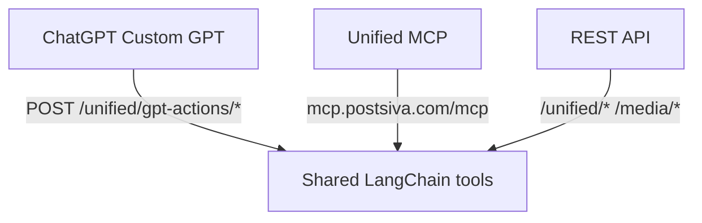

GPT Actions let a **ChatGPT Custom GPT** call Postsiva tools directly. Each tool is a `POST` endpoint with a JSON body matching the MCP tool schema.

OpenAPI schema: `GET https://backend.postsiva.com/openapi/chatgpt-actions.json`

## Requirements

- **Pro plan** with `gpt_app_enabled`
- Connected social accounts in the target workspace
- Either **ChatGPT OAuth** (Connect to Postsiva) or a **workspace API key**

<Note>
  GPT Actions omit **`web_search_duckduckgo`** and **`clear_workspace_chat_history`**. Everything else matches the [MCP tool catalog](/mcp/tools).
</Note>

---

## Authentication

Two supported methods:

| Method | When to use | Header |
|--------|-------------|--------|
| **OAuth (recommended)** | End users in ChatGPT | `Authorization: Bearer <JWT from Connect to Postsiva>` |
| **API key** | Internal/testing Custom GPTs | `X-API-Key: psk_live_YOUR_KEY` or `Authorization: Bearer psk_live_YOUR_KEY` |

OAuth flow:

1. User clicks **Connect to Postsiva** in ChatGPT
2. Signs in at `https://backend.postsiva.com/auth/oauth/login`
3. Selects a workspace
4. ChatGPT receives a Bearer JWT scoped to that workspace

Discovery endpoint: `GET /.well-known/oauth-protected-resource`

---

## Call a tool

### `POST /unified/gpt-actions/{tool_name}`

Replace `{tool_name}` with the exact MCP tool name (snake_case).

**Base URL**

```
https://backend.postsiva.com
```

**Headers**

```
Content-Type: application/json
Authorization: Bearer YOUR_TOKEN_OR_PSK
```

### Example — list accounts

<CodeGroup>

```bash cURL
curl -X POST "https://backend.postsiva.com/unified/gpt-actions/get_accounts" \
  -H "Content-Type: application/json" \
  -H "X-API-Key: psk_live_YOUR_KEY" \
  -d '{}'
```

```javascript JavaScript
const res = await fetch("https://backend.postsiva.com/unified/gpt-actions/get_accounts", {
  method: "POST",
  headers: {
    "Content-Type": "application/json",
    "Authorization": "Bearer psk_live_YOUR_KEY",
  },
  body: JSON.stringify({}),
});
```

```python Python
import requests

r = requests.post(
    "https://backend.postsiva.com/unified/gpt-actions/get_accounts",
    headers={
        "Content-Type": "application/json",
        "X-API-Key": "psk_live_YOUR_KEY",
    },
    json={},
)
print(r.json())
```

</CodeGroup>

**Response example**

```json
{
  "success": true,
  "platforms": ["linkedin", "instagram"],
  "profiles": {
    "linkedin": { "name": "Jane Doe", "handle": "jane-doe" },
    "instagram": { "username": "janedoesocial" }
  }
}
```

### Example — idea to content

<CodeGroup>

```bash cURL
curl -X POST "https://backend.postsiva.com/unified/gpt-actions/idea_to_content" \
  -H "Content-Type: application/json" \
  -H "Authorization: Bearer YOUR_OAUTH_JWT" \
  -d '{
    "platforms": ["linkedin", "threads"],
    "idea": "Why async standups beat daily video calls",
    "user_requirements": "Include one stat placeholder"
  }'
```

</CodeGroup>

### Example — publish

<CodeGroup>

```bash cURL
curl -X POST "https://backend.postsiva.com/unified/gpt-actions/publish" \
  -H "Content-Type: application/json" \
  -H "Authorization: Bearer YOUR_OAUTH_JWT" \
  -d '{
    "post_type": "text",
    "platforms": ["linkedin"],
    "default_text": "Async standups save 30 minutes per week per engineer.",
    "draft": false
  }'
```

</CodeGroup>

---

## Available tools

| Tool | Description |
|------|-------------|
| `get_accounts` | List connected platforms or one profile |
| `get_queued_posts` | Scheduled posts and drafts |
| `get_user_posts` | Recent posts per platform |
| `get_unified_analytics` | Stored cross-platform analytics |
| `get_comments` | Comments on recent posts |
| `reply_to_comment` | Reply to a comment |
| `manage_platform_connection` | OAuth connect URL or disconnect |
| `idea_to_content` | Topic → per-platform copy |
| `content_to_image` | Copy → generated images |
| `media_to_content` | Image/video URL → captions |
| `analyze_media` | Describe image or video URL |
| `publish` | Publish, draft, or schedule |
| `disconnect_gpt_connector` | Revoke ChatGPT OAuth session |

<Note>
  Tool bodies match MCP arguments exactly. Import the OpenAPI schema for full JSON Schema per operation.
</Note>

---

## OpenAPI schema

### `GET /openapi/chatgpt-actions.json`

Public, no auth required. Import this URL when creating a Custom GPT:

```
https://backend.postsiva.com/openapi/chatgpt-actions.json
```

The schema includes:

- OpenAPI **3.1.0**
- One `POST` path per tool under `/unified/gpt-actions/{operationId}`
- Request body schemas from Pydantic tool inputs
- `BearerAuth` security scheme (OAuth JWT or `psk_live_` key)
- `x-openai-action-timeout: 120` (seconds)

<CodeGroup>

```bash cURL
curl "https://backend.postsiva.com/openapi/chatgpt-actions.json"
```

</CodeGroup>

---

## Disconnect ChatGPT connector

### `POST /unified/gpt-actions/disconnect_gpt_connector`

Revokes the **ChatGPT OAuth Bearer token** so the next Action call returns `401` until the user reconnects.

- Does **not** unlink social platforms (use `manage_platform_connection` with `action=disconnect` for that)
- **No-op success** when authenticated with an API key (nothing to revoke)

**Request body:** `{}` (empty JSON object)

<CodeGroup>

```bash cURL
curl -X POST "https://backend.postsiva.com/unified/gpt-actions/disconnect_gpt_connector" \
  -H "Content-Type: application/json" \
  -H "Authorization: Bearer YOUR_OAUTH_JWT" \
  -d '{}'
```

</CodeGroup>

**Response example (OAuth revoked)**

```json
{
  "success": true,
  "revoked_oauth_token": true,
  "detail": "Connector session revoked. Reconnect to Postsiva in ChatGPT on your next request."
}
```

**Response example (API key auth)**

```json
{
  "success": true,
  "revoked_oauth_token": false,
  "detail": "No OAuth Bearer token was revoked (e.g. you use an API key, or token was invalid). Social accounts in Postsiva are unchanged; use disconnect_social_platform to unlink a network."
}
```

---

## REST vs MCP vs GPT Actions



| Feature | MCP | GPT Actions |
|---------|-----|-------------|
| Transport | Streamable HTTP MCP | OpenAPI REST |
| Web search | Yes (`web_search_duckduckgo`) | No |
| Clear chat history | No | No |
| Auth | API key only | OAuth or API key |
| Timeout | Client-defined | 120s (OpenAPI hint) |

---

## Errors

| Status | Meaning |
|--------|-------|
| `401` | Missing auth or revoked OAuth — user must reconnect in ChatGPT |
| `402` / plan message | `gpt_app_enabled` not on current plan |
| `422` | Invalid JSON body or schema validation failure |
| `200` with `success: false` | Tool-level error inside JSON payload |

---

## Setup guide

See [ChatGPT Custom GPT setup](/mcp/chatgpt) for step-by-step Custom GPT configuration, OAuth URLs, and privacy instructions.

## Next

<CardGroup cols={2}>
  <Card title="ChatGPT setup" href="/mcp/chatgpt">Custom GPT walkthrough</Card>
  <Card title="MCP tools" href="/mcp/tools">Full tool reference</Card>
  <Card title="Plans" href="/reference/plans">Pro plan requirements</Card>
</CardGroup>
