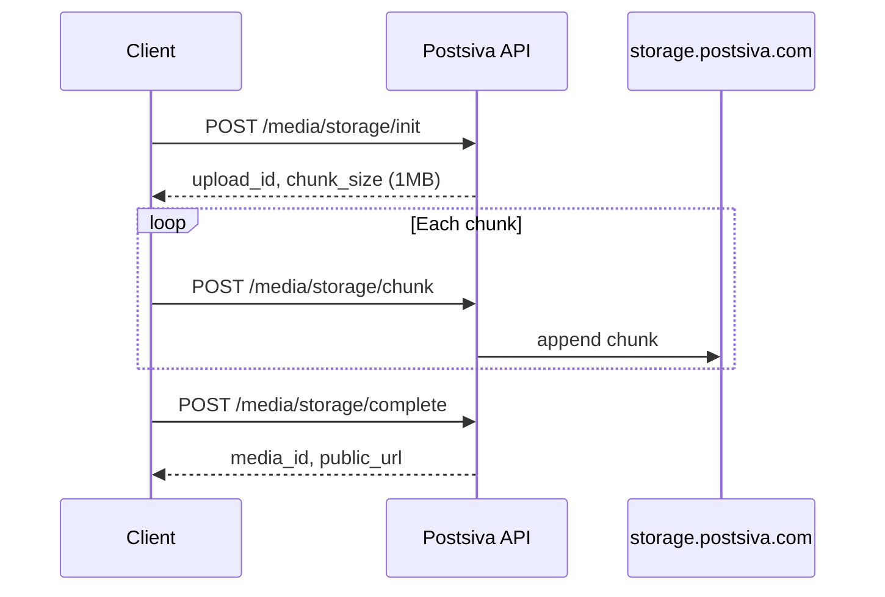

All media is stored on **storage.postsiva.com**. Upload returns a **`media_id`** (UUID) to pass to [Posting](/apis/posting) endpoints as `default_image_id`, `video_id`, or carousel `image_ids`.

## Base URL & auth

```
https://backend.postsiva.com
```

| Header | Required | Notes |
|--------|----------|-------|
| `X-API-Key` or `Authorization: Bearer` | Yes | Workspace API key or JWT |
| `X-Workspace-Id` | Platform-scoped uploads | Required when `platform` is set (LinkedIn, Instagram, etc.) |
| `Content-Type` | Multipart uploads | `multipart/form-data` for file uploads |

<CodeGroup>

```bash cURL
curl -X POST "https://backend.postsiva.com/media/upload" \
  -H "X-API-Key: psk_live_YOUR_KEY" \
  -F "media=@photo.jpg" \
  -F "media_type=image"
```

```javascript JavaScript
const form = new FormData();
form.append("media", fileInput.files[0]);
form.append("media_type", "image");

const res = await fetch("https://backend.postsiva.com/media/upload", {
  method: "POST",
  headers: { "X-API-Key": "psk_live_YOUR_KEY" },
  body: form,
});
const { media_id, public_url } = await res.json();
```

```python Python
import requests

with open("photo.jpg", "rb") as f:
    r = requests.post(
        "https://backend.postsiva.com/media/upload",
        headers={"X-API-Key": "psk_live_YOUR_KEY"},
        files={"media": f},
        data={"media_type": "image"},
    )
media = r.json()
```

</CodeGroup>

<Note>
Use returned `media_id` in [POST /unified/post/image](/apis/posting), [carousel](/apis/posting), or [video](/apis/posting) requests.
</Note>

## POST /media/upload

Single endpoint for **image**, **video**, or **multiple images** (carousel batch upload).

### Form fields

| Field | Type | Required | Description |
|-------|------|----------|-------------|
| `media_type` | `string` | Yes | `image`, `video`, or `images` (multiple) |
| `media` | file | Single upload | Image or video file |
| `media_url` | `string` | Single upload | Alternative: fetch from HTTPS URL |
| `images` | file[] | Multi upload | Multiple image files (`media_type=images`) |
| `image_urls` | `string` | Multi upload | Comma-separated image URLs |
| `platform` | `string` | No | Scope storage: `instagram`, `linkedin`, `facebook`, `tiktok`, `youtube`, `pinterest`, `threads`, `twitter` |

Provide **either** file(s) **or** URL(s) — not empty.

### Single image

<CodeGroup>

```bash cURL
curl -X POST "https://backend.postsiva.com/media/upload" \
  -H "X-API-Key: psk_live_YOUR_KEY" \
  -H "X-Workspace-Id: YOUR_WORKSPACE_UUID" \
  -F "media=@photo.jpg" \
  -F "media_type=image" \
  -F "platform=instagram"
```

```javascript JavaScript
const form = new FormData();
form.append("media", file);
form.append("media_type", "image");
form.append("platform", "instagram");

await fetch("https://backend.postsiva.com/media/upload", {
  method: "POST",
  headers: {
    "X-API-Key": process.env.POSTSIVA_KEY,
    "X-Workspace-Id": process.env.WORKSPACE_ID,
  },
  body: form,
});
```

```python Python
import requests

requests.post(
    "https://backend.postsiva.com/media/upload",
    headers={
        "X-API-Key": "psk_live_YOUR_KEY",
        "X-Workspace-Id": "YOUR_WORKSPACE_UUID",
    },
    files={"media": open("photo.jpg", "rb")},
    data={"media_type": "image", "platform": "instagram"},
)
```

</CodeGroup>

### Single video

```bash
curl -X POST "https://backend.postsiva.com/media/upload" \
  -H "X-API-Key: psk_live_YOUR_KEY" \
  -F "media=@clip.mp4" \
  -F "media_type=video"
```

### Multiple images (carousel batch)

Minimum **2** images, maximum **35** per request. Returns an array of ids.

```bash
curl -X POST "https://backend.postsiva.com/media/upload" \
  -H "X-API-Key: psk_live_YOUR_KEY" \
  -F "images=@slide1.jpg" \
  -F "images=@slide2.jpg" \
  -F "media_type=images"
```

### Upload response (single)

```json
{
  "success": true,
  "message": "Media uploaded successfully",
  "media_id": "a1b2c3d4-e5f6-7890-abcd-ef1234567890",
  "public_url": "https://storage.postsiva.com/...",
  "filename": "photo.jpg",
  "file_size": 245760,
  "media_type": "image",
  "platform": "instagram",
  "platform_user_id": "17841400000000000"
}
```

### Upload response (multiple)

```json
{
  "success": true,
  "message": "Uploaded 3 images",
  "uploaded_count": 3,
  "failed_count": 0,
  "media_ids": [
    "11111111-1111-1111-1111-111111111111",
    "22222222-2222-2222-2222-222222222222",
    "33333333-3333-3333-3333-333333333333"
  ],
  "public_urls": [
    "https://storage.postsiva.com/.../1.jpg",
    "https://storage.postsiva.com/.../2.jpg",
    "https://storage.postsiva.com/.../3.jpg"
  ]
}
```

### With vs without `platform`

| Mode | `platform` | Storage key | When to use |
|------|------------|-------------|-------------|
| **Workspace library** | omitted | `(null, null)` | General assets; works with most [posting](/apis/posting) flows |
| **Platform-scoped** | e.g. `tiktok` | `(platform, platform_user_id)` | Required for some networks (TikTok, Threads, Bluesky video/image) |

<Warning>
Platform-scoped uploads require the account to be **connected** via [OAuth](/apis/oauth) and `X-Workspace-Id` when the platform resolver needs workspace context.
</Warning>

## Chunked upload (large videos)

For large files, use the storage chunk API instead of a single multipart POST.

### Flow



### POST /media/storage/init

JSON body:

| Field | Type | Required | Description |
|-------|------|----------|-------------|
| `filename` | `string` | Yes | Original filename |
| `file_size` | `integer` | Yes | Total bytes |
| `total_chunks` | `integer` | Yes | Number of chunks (chunk size = **1 MB**) |
| `platform` | `string` | No | Omit for workspace library; or match target platform |
| `media_type` | `string` | No | Default `video` |

```json
{
  "upload_id": "upload_abc123",
  "chunk_size": 1048576
}
```

Requires `X-Workspace-Id`.

### POST /media/storage/chunk

Multipart form:

| Field | Description |
|-------|-------------|
| `upload_id` | From init |
| `chunk_number` | 1-based index |
| `file` | Chunk binary |

```json
{ "success": true }
```

### POST /media/storage/complete

JSON body:

| Field | Type | Required | Description |
|-------|------|----------|-------------|
| `upload_id` | `string` | Yes | From init |
| `platform` | `string` | No | Must match init |
| `media_type` | `string` | No | Default `video` |

Returns same shape as direct upload: `media_id`, `public_url`, etc.

### GET /media/storage/progress

| Query | Description |
|-------|-------------|
| `upload_id` | Track `uploaded_chunks`, `total_chunks`, `status` |

```bash
curl "https://backend.postsiva.com/media/storage/progress?upload_id=upload_abc123" \
  -H "Authorization: Bearer YOUR_JWT"
```

## GET /media

List media for the current workspace.

| Query | Default | Description |
|-------|---------|-------------|
| `media_type` | — | Filter: `image` or `video` |
| `platform` | — | Filter by platform name |
| `limit` | `50` | Page size, 1–100 |
| `offset` | `0` | Pagination offset |

Requires `X-Workspace-Id`.

```bash
curl "https://backend.postsiva.com/media/?media_type=image&limit=20" \
  -H "X-API-Key: psk_live_YOUR_KEY" \
  -H "X-Workspace-Id: YOUR_WORKSPACE_UUID"
```

## GET /media/{id}

Fetch one media record by UUID.

```bash
curl "https://backend.postsiva.com/media/a1b2c3d4-e5f6-7890-abcd-ef1234567890" \
  -H "X-API-Key: psk_live_YOUR_KEY"
```

```json
{
  "success": true,
  "message": "Media retrieved successfully",
  "media_id": "a1b2c3d4-e5f6-7890-abcd-ef1234567890",
  "public_url": "https://storage.postsiva.com/...",
  "filename": "photo.jpg",
  "file_size": 245760,
  "media_type": "image",
  "platform": null,
  "platform_user_id": null
}
```

## DELETE /media/{id}

Delete one media item from DB and storage.

```bash
curl -X DELETE "https://backend.postsiva.com/media/a1b2c3d4-e5f6-7890-abcd-ef1234567890" \
  -H "X-API-Key: psk_live_YOUR_KEY"
```

```json
{
  "success": true,
  "message": "Media deleted successfully"
}
```

### Bulk and filter delete

| Method | Path | Description |
|--------|------|-------------|
| `DELETE` | `/media/bulk` | JSON body `{ "media_ids": ["uuid", ...] }` — max 100 ids |
| `DELETE` | `/media/filter?platform=instagram&media_type=image` | Delete all matching media |

<Warning>
`DELETE /media/filter` removes **all** media matching the filter for the authenticated user. Use with caution.
</Warning>

## Using media_id in posts

After upload, reference ids in [Posting](/apis/posting):

```json
{
  "platforms": ["linkedin", "instagram"],
  "default_image_id": "a1b2c3d4-e5f6-7890-abcd-ef1234567890",
  "default_text": "New creative"
}
```

For carousel posts, pass 2–20 ids in `image_ids` (not the bulk upload endpoint count limit of 35 — posting validates 2–20).

## MCP equivalent

The **`publish`** tool accepts `default_image_id`, `default_image_url`, `video_id`, and `video_url`. Upload media via REST first, then call MCP `publish` with the returned id.

See [MCP tools](/mcp/tools) and [Posting](/apis/posting).

## Related

- [Posting](/apis/posting) — consume `media_id` in publish requests
- [OAuth](/apis/oauth) — connect accounts before platform-scoped uploads
- [Authentication](/authentication) — workspace headers and API keys
