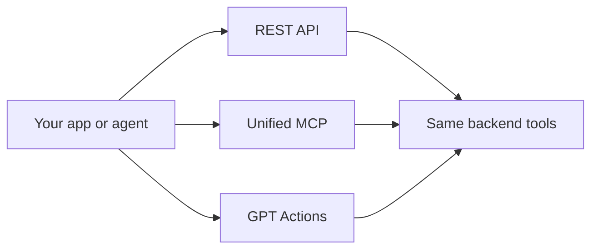

The Postsiva REST API is a JSON HTTP API scoped to **workspaces**. Use a workspace API key for server-to-server and automation integrations.

## Base URL

```
https://backend.postsiva.com
```

Local development: `http://localhost:8000`

## Authorization

```bash
X-API-Key: psk_live_YOUR_WORKSPACE_KEY
Content-Type: application/json
```

See [Authentication](/authentication) for Bearer format, scopes, and plan gates.

## Canonical API prefixes

| Prefix | Use |
|--------|-----|
| `/unified/post/*` | Publish, draft, schedule |
| `/unified/oauth/*` | Connect accounts |
| `/unified/posts`, `/unified/drafts`, `/unified/scheduled-posts` | Lists and queue |
| `/unified/comments`, `/unified/analytics` | Inbox and metrics |
| `/unified/user-profiles/` | Connected account metadata |
| `/media/*` | Upload and media library (not under `/unified`) |
| `/workspace-agent/website/chat` | LangGraph agent |
| `/unified/gpt-actions/{tool}` | ChatGPT Actions |

<Note>
  **Legacy paths:** Older mobile/extension builds may still call `/social/post`, `/social/oauth`, or `/social/drafts`. The backend temporarily rewrites these to `/unified/*`. New integrations must use `/unified/*` only.
</Note>

<Warning>
  **JWT-only route:** `GET /unified/ai-autoreplier/admin/overview` (cross-workspace admin).
</Warning>

## Endpoint groups

| Group | Prefix / path | Description |
|-------|---------------|-------------|
| **Posting** | `POST /unified/post/*` | Text, image, video, carousel — publish, draft, schedule |
| **Posts** | `GET /unified/posts` | Recent posts per platform |
| **Scheduled** | `/unified/scheduled-posts` | Queue CRUD, publish-now |
| **Drafts** | `/unified/drafts` | Draft CRUD, publish, schedule |
| **Analytics** | `GET /unified/analytics` | Cross-platform totals |
| **Comments** | `/unified/comments` | List and reply |
| **OAuth** | `/unified/oauth/*` | Connect, status, disconnect |
| **Profiles** | `GET /unified/user-profiles/` | Connected account metadata |
| **Media** | `/media/*` | Upload images and videos |
| **AI content** | `/unified/content`, `/unified/image` | Generate copy and images |
| **AI Watcher** | `/unified/ai-autoreplier/*` | Comment watch, leads, auto-reply |
| **Agent chat** | `POST /workspace-agent/website/chat` | Full LangGraph agent |
| **GPT Actions** | `POST /unified/gpt-actions/{tool}` | ChatGPT Custom GPT mirror |

## REST vs MCP vs GPT Actions



- **REST** — you choose the endpoint and body
- **MCP** — the AI agent picks tools (`publish`, `get_user_posts`, …)
- **GPT Actions** — REST POST per tool for ChatGPT (no web search tool)

## Timestamps

Use ISO 8601 UTC for scheduling:

```
2026-07-10T14:30:00Z
```

## OpenAPI

ChatGPT Actions schema: `GET /openapi/chatgpt-actions.json`

## Next

<CardGroup cols={2}>
  <Card title="AI content" href="/apis/ai-content">Generate copy and images</Card>
  <Card title="Agent chat" href="/apis/agent-chat">LangGraph workspace agent</Card>
  <Card title="GPT Actions" href="/apis/gpt-actions">ChatGPT Custom GPT mirror</Card>
  <Card title="MCP overview" href="/mcp/overview">Agent integration</Card>
</CardGroup>
