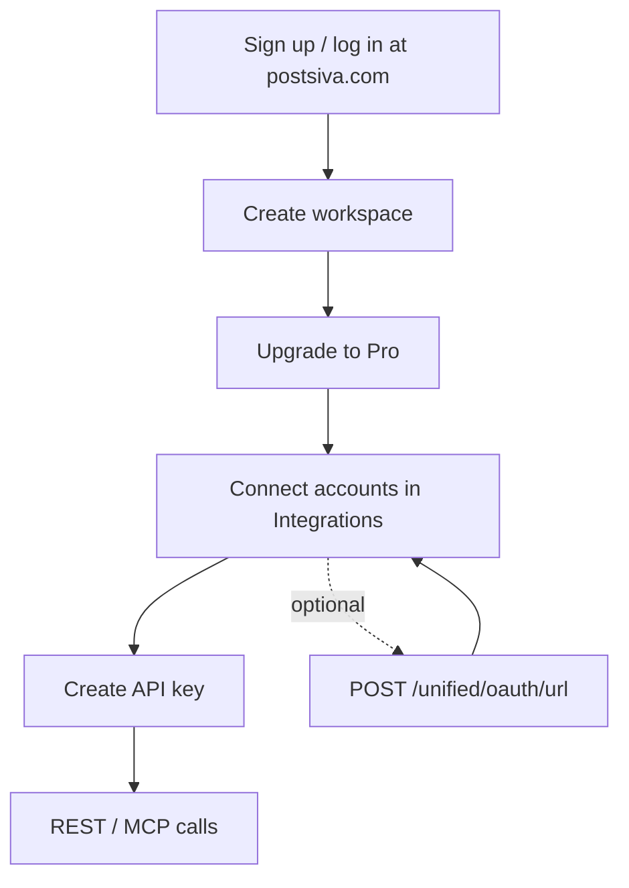

This guide walks you from **zero → REST API ready**:

1. **Sign up / log in** at [postsiva.com](https://postsiva.com)
2. **Create a workspace**
3. **Connect accounts** (Settings → Integrations)
4. **Create API key** (Settings → API Keys) — use all REST APIs
5. **Post / automate** via REST or MCP



<Note>
  API keys and Unified MCP require the **Pro** plan (`api_keys_enabled` + `mcp_enabled`). See [Plans](/reference/plans).
</Note>

---

## Part 1 — What to do in the Postsiva UI

Complete these in the web app at [postsiva.com](https://postsiva.com) (or your workspace URL).

### 1. Sign up or log in

1. Go to [postsiva.com](https://postsiva.com) — **sign up** or **log in**.
2. Create a **workspace** (or accept an invite).
3. Confirm the correct workspace in the switcher. All OAuth tokens, posts, and API keys are scoped to it.

### 2. Upgrade if you need API / MCP

1. Go to **Settings → Billing** (or Pricing).
2. Subscribe to **Pro** (or higher) so **API Keys** and **MCP** are unlocked.
3. After upgrade, refresh Settings — API Keys and MCP should no longer show a plan gate.

### 3. Connect social accounts (Integrations)

1. Open **Settings → Integrations** (or Connect accounts).
2. Click each network you need: **LinkedIn, Facebook, Instagram, TikTok, YouTube, Threads, Pinterest, Bluesky**.
3. Finish the OAuth popup (grant all requested permissions).
4. For **Facebook**: pick the **Pages** you want to manage.
5. For **LinkedIn**: enable **company / org pages** if you will post as pages (not only personal).
6. For **Pinterest**: note which **boards** exist (you need board IDs when posting).
7. For **Bluesky**: enter **handle** + **app password** (no OAuth redirect).
8. Confirm each site shows **Connected**.

<Warning>
  If a platform is not connected in this workspace, posting and analytics return `NOT_CONNECTED` (or empty slices). Connect in the UI **or** via [OAuth API](/apis/oauth) below.
</Warning>

### 4. Create a workspace API key (use REST APIs)

1. Open **Settings → API Keys** (under Integrations / developer settings in the app).
2. Click **Create API Key**.
3. Set:
   - **Name** — e.g. `n8n production`
   - **Scope** — see [IDs and scopes](/reference/ids-and-scopes):
     - `full` — all platforms (best for most integrations)
     - `linkedin,instagram` — only those platforms for connect/post
     - `linkedin_only` — LinkedIn only (default in some setups)
     - `linkedin_posts` — **read-only** `GET /unified/posts` (LinkedIn)
4. Copy the secret once: `psk_live_…` — it is **not** shown again.
5. Store it in your password manager / secrets store (never in git).

Use this key as `X-API-Key: psk_live_…` on **every REST request** to `https://backend.postsiva.com`. See [API Overview](/apis/overview).

### 5. (Optional) Copy MCP URL for Cursor / Claude

1. Open **Settings → MCP** (or Integrations → MCP).
2. **CLI** (Cursor / Claude Code): `https://mcp.postsiva.com/mcp` with header `X-API-Key: psk_live_YOUR_KEY`
3. **Claude.ai**: `https://mcp.postsiva.com/web/mcp` with **OAuth only** (no API key)
4. **ChatGPT MCP**: `https://mcp.postsiva.com/web/mcp?api-key=psk_live_YOUR_KEY`
5. Follow [Connect MCP](/mcp/connect) and [Cursor](/mcp/cursor).

### 6. Smoke-test in the UI (recommended)

Before scripting:

1. Use the **Composer** to publish a small test post to one connected account.
2. Open **Inbox / Comments** and **Analytics** once so data exists in the DB for API reads.

---

## Part 2 — Connect accounts programmatically

Use these when building onboarding into **your** product (users never touch Postsiva UI for linking).

### Auth for OAuth routes

| Mode | Headers |
|------|---------|
| API key | `X-API-Key: psk_live_…` (workspace from key) |
| JWT | `Authorization: Bearer <token>` + `X-Workspace-Id: <uuid>` |

Key **scope** restricts which platforms you may connect (e.g. `linkedin_only` cannot start Instagram OAuth).

### A) Start OAuth / get connect URL

`POST /unified/oauth/url`

```bash
curl -X POST "https://backend.postsiva.com/unified/oauth/url" \
  -H "Content-Type: application/json" \
  -H "X-API-Key: psk_live_YOUR_KEY" \
  -d '{"platform":["linkedin","instagram","facebook","tiktok","youtube","pinterest","threads"]}'
```

**Body**

| Field | Type | Required | Description |
|-------|------|----------|-------------|
| `platform` | `string` or `string[]` | Yes | Platforms to connect (comma-separated strings split). |
| `handle` | string | Bluesky only | e.g. `you.bsky.social` |
| `app_password` | string | Bluesky only | Bluesky app password |

**Response (OAuth platforms)**

```json
{
  "results": {
    "linkedin": {
      "success": true,
      "message": "Open URL to connect LinkedIn",
      "auth_url": "https://www.linkedin.com/oauth/v2/authorization?..."
    },
    "instagram": {
      "success": true,
      "message": "",
      "auth_url": "https://api.instagram.com/oauth/authorize?..."
    }
  }
}
```

Open each `auth_url` in the browser (or redirect the end user). After callback, Postsiva stores tokens on the **workspace**.

### B) Bluesky connect (no redirect)

```bash
curl -X POST "https://backend.postsiva.com/unified/oauth/url" \
  -H "Content-Type: application/json" \
  -H "X-API-Key: psk_live_YOUR_KEY" \
  -d '{
    "platform": ["bluesky"],
    "handle": "you.bsky.social",
    "app_password": "xxxx-xxxx-xxxx-xxxx"
  }'
```

`auth_url` is `null` on success — connect completes in this call.

### C) Check connection status

`GET /unified/oauth/token`

```bash
# All platforms (respects key scope)
curl "https://backend.postsiva.com/unified/oauth/token" \
  -H "X-API-Key: psk_live_YOUR_KEY"

# Specific platforms
curl "https://backend.postsiva.com/unified/oauth/token?platform=linkedin&platform=facebook" \
  -H "X-API-Key: psk_live_YOUR_KEY"
```

Look for `"connected": true` per platform. Token payloads may include platform user/page ids — **treat access tokens as secrets**.

### D) Disconnect

`DELETE /unified/oauth/token?platform=linkedin&platform=instagram`

```bash
curl -X DELETE \
  "https://backend.postsiva.com/unified/oauth/token?platform=linkedin" \
  -H "X-API-Key: psk_live_YOUR_KEY"
```

### E) Same flow via MCP

Tool: **`manage_platform_connection`**

| Argument | Values |
|----------|--------|
| `action` | `connect` → returns OAuth URL; `disconnect` → unlinks |
| `platform` | `linkedin`, `instagram`, `facebook`, `tiktok`, `youtube`, `pinterest`, `threads`, `bluesky` |

Tool: **`get_accounts`** — list connections / profile metadata.

---

## Part 3 — After connect: automate with the API key

Always send:

```
X-API-Key: psk_live_YOUR_KEY
Content-Type: application/json
```

Workspace is taken from the key — **`X-Workspace-Id` is optional** (must match if sent).

### Typical automation sequence

<Steps>
  <Step title="Confirm accounts">
    `GET /unified/oauth/token` or MCP `get_accounts`.
  </Step>
  <Step title="Upload media (if needed)">
    `POST /media/upload` → save `media_id` / `public_url`. See [Media](/apis/media).
  </Step>
  <Step title="Optional AI draft">
    `POST /unified/content/generate` or MCP `idea_to_content`. See [AI Content](/apis/ai-content).
  </Step>
  <Step title="Publish, draft, or schedule">
    `POST /unified/post/text|image|carousel|video` — see [Posting](/apis/posting) and the full [Posting parameters](/apis/posting-parameters) reference.
  </Step>
  <Step title="Read back">
    `GET /unified/posts`, `GET /unified/analytics`, `GET /unified/comments`.
  </Step>
</Steps>

### Minimal first post (LinkedIn personal)

```bash
curl -X POST "https://backend.postsiva.com/unified/post/text" \
  -H "Content-Type: application/json" \
  -H "X-API-Key: psk_live_YOUR_KEY" \
  -d '{
    "platforms": ["linkedin"],
    "default_text": "Hello from the Postsiva API!"
  }'
```

### Facebook Page (required `facebook_page_ids`)

```bash
curl -X POST "https://backend.postsiva.com/unified/post/text" \
  -H "Content-Type: application/json" \
  -H "X-API-Key: psk_live_YOUR_KEY" \
  -d '{
    "platforms": ["facebook"],
    "default_text": "Hello on my Facebook Page",
    "facebook": {
      "facebook_page_ids": ["YOUR_FACEBOOK_PAGE_ID"]
    }
  }'
```

Page IDs appear in the UI after connecting Facebook, or in OAuth token / account profile responses.

### LinkedIn company page + optional personal

```bash
curl -X POST "https://backend.postsiva.com/unified/post/text" \
  -H "Content-Type: application/json" \
  -H "X-API-Key: psk_live_YOUR_KEY" \
  -d '{
    "platforms": ["linkedin"],
    "default_text": "Update from our company",
    "linkedin": {
      "linkedin_page_ids": ["12345"],
      "post_to_personal": false
    }
  }'
```

### Image post using media_id

```bash
# 1) Upload
curl -X POST "https://backend.postsiva.com/media/upload" \
  -H "X-API-Key: psk_live_YOUR_KEY" \
  -H "X-Workspace-Id: YOUR_WORKSPACE_UUID" \
  -F "media=@photo.jpg" \
  -F "media_type=image"

# 2) Post with returned media_id
curl -X POST "https://backend.postsiva.com/unified/post/image" \
  -H "Content-Type: application/json" \
  -H "X-API-Key: psk_live_YOUR_KEY" \
  -d '{
    "platforms": ["linkedin", "instagram"],
    "default_image_id": "MEDIA_UUID_FROM_UPLOAD",
    "default_text": "Caption for all platforms"
  }'
```

---

## Part 4 — Checklist

| Done? | Step |
|-------|------|
| ☐ | Account + workspace |
| ☐ | Pro plan for API / MCP |
| ☐ | Social accounts connected (UI or OAuth API) |
| ☐ | Facebook Pages / LinkedIn orgs selected where needed |
| ☐ | API key created (`psk_live_…`) with correct scope |
| ☐ | Secrets stored securely |
| ☐ | Test `GET /unified/oauth/token` → `connected: true` |
| ☐ | Test `POST /unified/post/text` |
| ☐ | (Optional) MCP client configured |

---

## Next pages

<CardGroup cols={2}>
  <Card title="Posting parameters" icon="list" href="/apis/posting-parameters">
    Every unified + per-platform field for text, image, carousel, video.
  </Card>
  <Card title="OAuth API" icon="link" href="/apis/oauth">
    Full request/response for connect, status, disconnect.
  </Card>
  <Card title="Authentication" icon="key" href="/authentication">
    Headers, scopes, plan gates.
  </Card>
  <Card title="MCP tools" icon="robot" href="/mcp/tools">
    Agent tools including manage_platform_connection and publish.
  </Card>
</CardGroup>
