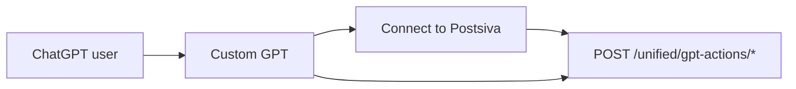

Build a **Custom GPT** that manages your Postsiva workspace: list accounts, generate content, publish posts, read analytics, and reply to comments — using the same tools as MCP and the WhatsApp agent.

Requires **Pro plan** with `gpt_app_enabled`.

---

## Overview



1. User chats with your Custom GPT
2. ChatGPT calls `POST /unified/gpt-actions/{tool_name}` with JSON bodies
3. User authenticates once via **Connect to Postsiva** (OAuth)
4. Actions run against the selected workspace

Full API reference: [GPT Actions](/apis/gpt-actions)

---

## Create the Custom GPT

<Steps>
  <Step title="Open GPT Builder">
    ChatGPT → **Explore GPTs** → **Create** → **Configure**
  </Step>
  <Step title="Import OpenAPI schema">
    **Actions** → **Import from URL**:

    ```
    https://backend.postsiva.com/openapi/chatgpt-actions.json
    ```

    This registers all Postsiva tools as Actions (publish, get_accounts, idea_to_content, etc.).
  </Step>
  <Step title="Configure authentication">
    **Authentication type:** OAuth

    | Field | Value |
    |-------|-------|
    | **Client ID** | From Postsiva (contact support or app settings if provided) |
    | **Client Secret** | Matching secret |
    | **Authorization URL** | `https://backend.postsiva.com/auth/oauth/authorize` |
    | **Token URL** | `https://backend.postsiva.com/auth/oauth/token` |
    | **Scope** | As defined in Postsiva OAuth config |

    Alternative for internal/testing: **API Key** with `Authorization: Bearer psk_live_YOUR_KEY` (not recommended for public GPTs).
  </Step>
  <Step title="Set instructions">
    Example system instructions:

    ```
    You are a Postsiva social media assistant.

    Rules:
    - Always confirm before publishing live posts or replying to comments publicly.
    - Use get_accounts first when platform connection is unclear.
    - idea_to_content, content_to_image, and media_to_content do NOT publish — follow with publish when the user wants to go live.
    - Scheduling times must be ISO 8601 UTC (e.g. 2026-07-10T14:30:00Z).
    - If the user wants to disconnect ChatGPT from Postsiva, call disconnect_gpt_connector.
    - You cannot search the web — do not claim live web results.
    ```
  </Step>
  <Step title="Test connection">
    Click **Connect to Postsiva** in the GPT preview, sign in, select workspace, then ask:

    > What social accounts are linked to my workspace?
  </Step>
</Steps>

---

## OAuth flow (Connect to Postsiva)

1. ChatGPT redirects to `GET /auth/oauth/authorize`
2. User signs in at `/auth/oauth/login` (email/password or Google)
3. User selects workspace at `/auth/oauth/select-workspace`
4. ChatGPT receives access token (Bearer JWT with `workspace_id`)
5. Subsequent Actions send `Authorization: Bearer <token>`

**Discovery:** `GET https://backend.postsiva.com/.well-known/oauth-protected-resource`

**Disconnect:** User asks GPT to disconnect, or you call:

```bash
POST /unified/gpt-actions/disconnect_gpt_connector
Authorization: Bearer <oauth_jwt>
Body: {}
```

See [GPT Actions — disconnect](/apis/gpt-actions#disconnect-chatgpt-connector).

<Note>
  `disconnect_gpt_connector` revokes the **ChatGPT session only**. Social accounts stay connected. Use `manage_platform_connection` with `action=disconnect` to unlink a network.
</Note>

---

## Available Actions

Same **12 tools** as MCP, excluding `web_search_duckduckgo`:

| Action | Use when user asks to… |
|--------|------------------------|
| `get_accounts` | See connected platforms or one profile |
| `get_queued_posts` | View scheduled posts or drafts |
| `get_user_posts` | List recent posts |
| `get_unified_analytics` | View engagement totals |
| `get_comments` | Read comments on posts |
| `reply_to_comment` | Post a public reply |
| `manage_platform_connection` | Connect or disconnect OAuth |
| `idea_to_content` | Turn a topic into post copy |
| `content_to_image` | Generate images from text |
| `media_to_content` | Write captions from image/video URL |
| `analyze_media` | Describe what's in media |
| `publish` | Post, draft, or schedule content |
| `disconnect_gpt_connector` | Log out ChatGPT from Postsiva |

Argument schemas are in the imported OpenAPI file.

---

## Example conversations

**Generate and draft**

> User: Write LinkedIn and Threads posts about our new API docs, then save LinkedIn as a draft.

GPT calls: `idea_to_content` → `publish` with `draft: true` for LinkedIn.

**Schedule**

> User: Schedule this for Friday 10am UTC on Instagram: [caption]. Image: [url]

GPT calls: `publish` with `post_type=image`, `scheduled_time`, and media fields.

**Analytics**

> User: How did my posts perform this month?

GPT calls: `get_unified_analytics`, optionally `get_user_posts` with `refresh_stats=true`.

---

## GPT Actions vs MCP

| | Custom GPT | MCP (Cursor) |
|---|------------|--------------|
| Auth | OAuth (user-facing) | API key |
| Web search | No | Yes (`web_search_duckduckgo`) |
| Audience | Non-technical users | Developers |
| OpenAPI | Required import | MCP tool list |
| Timeout | 120 seconds | Client-defined |

---

## Privacy and data

- Actions run against **one workspace** selected at OAuth time
- Post content and analytics pass through ChatGPT's conversation context — review OpenAI's data policies for your use case
- Do not embed `psk_live_` keys in public GPT instructions

---

## Troubleshooting

| Issue | Solution |
|-------|----------|
| Actions grayed out | Re-import OpenAPI; check Pro plan |
| 401 on every call | Reconnect via Connect to Postsiva |
| "Plan upgrade" message | Workspace needs `gpt_app_enabled` (Pro) |
| GPT tries to web search | Remind in instructions — tool not available |
| Wrong workspace | Disconnect OAuth, reconnect, pick correct workspace |

---

## Alternative: API key testing

For private GPTs or development, set Authentication to **API Key**:

```
Authorization: Bearer psk_live_YOUR_KEY
```

All Actions resolve workspace from the key. No OAuth UI required.

<Warning>
  Never publish a Custom GPT that exposes your personal API key in instructions or shared links.
</Warning>

## Next

<CardGroup cols={2}>
  <Card title="GPT Actions API" href="/apis/gpt-actions">Endpoint reference</Card>
  <Card title="Plans" href="/reference/plans">Pro requirements</Card>
  <Card title="MCP overview" href="/mcp/overview">Developer agent integration</Card>
</CardGroup>
