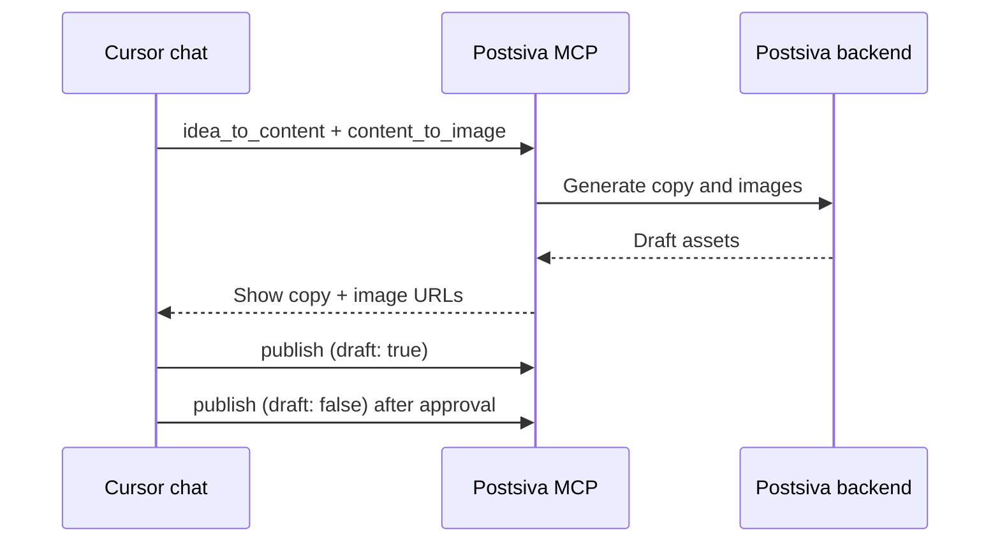

Use Postsiva MCP inside **Cursor** to manage social accounts from your editor: check connections, draft posts, publish, read analytics, and reply to comments — all via natural language.

Cursor uses the **CLI** MCP endpoint (`/mcp`) with curl-based media upload.

## Prerequisites

- **Pro plan** with `mcp_enabled`
- Workspace API key (`psk_live_…`) from [Settings → API Keys](https://postsiva.com/settings/api-keys)
- At least one social account connected in that workspace
- Cursor with MCP support (Settings → MCP)

---

## Install

<Steps>
  <Step title="Open MCP settings">
    Cursor → **Settings** → **MCP** → **Add server**
  </Step>
  <Step title="Configure HTTP transport">
    - **Type:** HTTP (Streamable HTTP)
    - **URL:** `https://mcp.postsiva.com/mcp`
    - **Header:** `X-API-Key` = your `psk_live_…` key
  </Step>
  <Step title="Restart Cursor">
    Reload MCP or restart Cursor so the server connects.
  </Step>
</Steps>

### `mcp.json` (project or global)

Add to `.cursor/mcp.json` in your project, or `~/.cursor/mcp.json` globally:

```json
{
  "mcpServers": {
    "Postsiva": {
      "url": "https://mcp.postsiva.com/mcp",
      "headers": {
        "X-API-Key": "psk_live_YOUR_KEY"
      }
    }
  }
}
```

<Warning>
  Do not commit real API keys. Use environment-specific config or Cursor's secret storage for production keys.
</Warning>

Alternative auth via query string (less recommended):

```
https://mcp.postsiva.com/mcp?apikey=psk_live_YOUR_KEY
```

---

## Verify connection

In Cursor Agent chat, try:

> What social accounts are connected to my Postsiva workspace?

The agent should call **`get_accounts`** and list linked platforms.

If you see *"API key required"* or *"Invalid or expired API key"*, check the header and Pro plan status.

---

## Example prompts

### Accounts and OAuth

```
List all connected social platforms and their profile names.

Generate an OAuth link to connect TikTok to my workspace.
```

### Content pipeline

```
Turn this idea into LinkedIn and Threads post copy: "Why we open-sourced our design system"

Generate Instagram and LinkedIn images from this caption: "Launch day is here 🚀"

Analyze this image URL and suggest a caption for Instagram: https://cdn.example.com/hero.jpg
```

### Publishing

```
Post this text to LinkedIn and Bluesky: "We just shipped unified analytics — check it out."

Save a draft Instagram post with this caption and image URL: [caption] / [url]

Schedule this for tomorrow 14:00 UTC on LinkedIn: [text]
```

### Read and engage

```
Show my last 10 LinkedIn posts with engagement stats.

Get comments on my most recent Instagram post and draft replies to unanswered ones.

Pull unified analytics for this workspace — totals and per-platform breakdown.
```

### Queue management

```
List all scheduled posts for the next 7 days.

Show saved drafts across all platforms.
```

---

## Common workflows

### Draft → review → publish



1. Ask for **`idea_to_content`** — review copy in chat
2. Ask for **`content_to_image`** — confirm image URLs
3. Ask to **`publish`** with `draft: true` first, then live when ready

### Weekly analytics review

```
1. get_unified_analytics
2. get_user_posts with refresh_stats=true for linkedin, limit=5
3. Summarize top performer and suggest next week's content themes
```

### Comment triage

```
1. get_comments with platforms=["instagram","linkedin"]
2. For each unanswered comment, reply_to_comment with a helpful response
```

---

## Tool reference

Cursor exposes all **13 MCP tools**. See the [Tool catalog](/mcp/tools) for arguments and REST equivalents.

| Category | Tools |
|----------|-------|
| Accounts | `get_accounts`, `manage_platform_connection` |
| Posts | `publish`, `get_user_posts`, `get_queued_posts` |
| Inbox | `get_comments`, `reply_to_comment` |
| Analytics | `get_unified_analytics` |
| AI | `idea_to_content`, `content_to_image`, `media_to_content`, `analyze_media` |
| Utility | `web_search_duckduckgo` |

<Note>
  **`clear_workspace_chat_history`** is not on MCP — use `DELETE /user-agent-chats` or ask the WhatsApp/website agent to clear history.
</Note>

---

## Tips

- **Scoped keys:** Use `linkedin_only` or comma-separated platform scopes for safer automation — see [IDs and scopes](/reference/ids-and-scopes).
- **LinkedIn refresh:** `get_user_posts` with `refresh_posts=true` on personal LinkedIn is expensive (Apify) and caps at 2 posts — prefer cached data unless syncing live.
- **Character limits:** Generated copy may exceed platform limits — ask Cursor to trim before `publish`.
- **Parallel platforms:** `idea_to_content` and `content_to_image` run per platform in parallel; one failed platform does not block others.

---

## Troubleshooting

| Symptom | Fix |
|---------|-----|
| MCP server red / disconnected | Verify URL, restart Cursor, check key prefix `psk_live_` |
| Plan upgrade message | Upgrade to Pro; confirm `mcp_enabled` |
| Empty tool list | Re-add server; ensure Streamable HTTP (not stdio) |
| 403 on OAuth connect | API key scope may restrict platforms — use `full` scope |

## Next

<CardGroup cols={2}>
  <Card title="Connect to MCP" href="/mcp/connect">Transport and auth details</Card>
  <Card title="n8n integration" href="/mcp/n8n">Automation workflows</Card>
  <Card title="Tool catalog" href="/mcp/tools">All 13 tools</Card>
</CardGroup>
