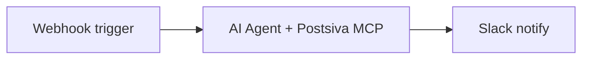

n8n can drive Postsiva in three ways:

1. **Community nodes** — `n8n-nodes-postsiva` package with 43 dedicated nodes (recommended for most workflows)
2. **MCP AI Agent** — natural-language tool selection (best for flexible AI workflows)
3. **REST HTTP Request** — deterministic calls to specific endpoints (best for custom or uncovered endpoints)

All use the same workspace API key and Pro plan requirements.

---

## Prerequisites

- n8n instance (cloud or self-hosted) with MCP or HTTP Request nodes
- **Pro plan** with `mcp_enabled` (MCP) or `api_keys_enabled` (REST)
- Workspace API key: `psk_live_YOUR_KEY`
- Social accounts connected in the target workspace

---

## Option A — Community nodes (recommended)

Install **`n8n-nodes-postsiva`** from **Settings → Community nodes** for 43 ready-made nodes: posting, scheduling, drafts, inbox, AI generation, AI Watcher, and brand persona.

See the full guide: [n8n integration](/integrations/n8n).

---

## Option B — MCP AI Agent

Use when the workflow should **decide** which Postsiva action to take based on incoming data or chat input.

### MCP server config

| Field | Value |
|-------|-------|
| **URL** | `https://mcp.postsiva.com/mcp` |
| **Transport** | Streamable HTTP |
| **Auth header** | `X-API-Key: psk_live_YOUR_KEY` |

In n8n's **AI Agent** node (or MCP Client tool):

1. Add MCP server **Postsiva** with the URL and header above
2. Connect the agent to your trigger (Webhook, Schedule, Slack, etc.)
3. System prompt example:

```
You manage social media via Postsiva MCP tools.
Always confirm before publishing live posts.
Use get_accounts first if platform connection is unclear.
Timestamps for scheduling must be ISO 8601 UTC.
```

### Example workflow — Webhook → Agent → Slack



**Webhook body:**

```json
{
  "instruction": "Draft a LinkedIn post about our n8n integration and save as draft"
}
```

**Agent tools used:** `idea_to_content` → `publish` with `draft: true`

### Example workflow — Scheduled content

1. **Schedule Trigger** — every Monday 08:00
2. **AI Agent** — "Generate 3 LinkedIn post ideas from our blog RSS themes and save top one as draft"
3. **HTTP Request** (optional) — notify team in Slack with draft link

---

## Option C — REST HTTP Request

Use for **fixed** pipelines where you know the exact endpoint.

### Shared credentials

Create n8n **Header Auth** credential:

| Header name | Value |
|-------------|-------|
| `X-API-Key` | `psk_live_YOUR_KEY` |

Base URL: `https://backend.postsiva.com`

### Pattern 1 — Generate and publish

**Node 1: HTTP Request — generate copy**

```
POST /unified/content/generate?workspace_id={{ $env.WORKSPACE_ID }}
Body (JSON):
{
  "idea": "{{ $json.topic }}",
  "platforms": ["linkedin"]
}
```

**Node 2: HTTP Request — publish**

```
POST /unified/post/text
Body (JSON):
{
  "platforms": ["linkedin"],
  "default_text": "{{ $json.data.linkedin.content }}"
}
```

### Pattern 2 — Sync analytics daily

```
GET /unified/analytics
Headers: X-API-Key
```

Store `$json` in Google Sheets, Airtable, or your data warehouse.

### Pattern 3 — Comment auto-reply (deterministic)

1. `GET /unified/comments?platforms=instagram&limit=5`
2. **IF** node — filter unanswered
3. `POST /unified/comments/reply?platform=instagram&comment_id={{ $json.id }}&text=Thanks for your comment!`

<Note>
  For AI-generated replies, use the **MCP AI Agent** with `get_comments` + `reply_to_comment` instead of hard-coded text.
</Note>

---

## Community nodes vs MCP vs REST

| | Community nodes | MCP AI Agent | HTTP Request |
|---|-----------------|--------------|--------------|
| Setup | Install `n8n-nodes-postsiva` + credential | MCP server + agent prompt | Per-endpoint nodes |
| Coverage | 43 Postsiva actions | Full MCP tool catalog | Any REST path |
| Flexibility | Medium — pick node + fields | High — agent picks tools | Low — fixed paths |
| Best for | Scheduled posts, inbox, watcher | Chatbots, variable instructions | Custom / debug endpoints |

See [n8n integration](/integrations/n8n) for community node workflows.

---

## Environment variables

Store secrets in n8n credentials or env vars:

```
POSTSIVA_API_KEY=psk_live_...
POSTSIVA_WORKSPACE_ID=aaa01a56-e769-44a6-87bf-cf6dfb9e7a27
POSTSIVA_BASE_URL=https://backend.postsiva.com
```

Reference in expressions: `{{ $env.POSTSIVA_API_KEY }}`

---

## Error handling

| Error | Action |
|-------|--------|
| `401` | Rotate or fix API key credential |
| Plan / `402` message | Upgrade workspace to Pro |
| Tool `success: false` | Branch on `$json.success`; log `$json.error` |
| Rate limits | Add Wait node; reduce schedule frequency |

Enable **Continue On Fail** on HTTP nodes only when downstream logic handles partial success (e.g. multi-platform publish).

---

## Example: RSS → AI → schedule

<Steps>
  <Step title="RSS Read">
    Trigger on new blog post URL
  </Step>
  <Step title="AI Generate Post from Idea">
    Postsiva node with `idea` = post title + summary, `platforms` = linkedin, threads
  </Step>
  <Step title="Create Scheduled Post">
    Postsiva node with caption from AI output and `scheduled_time` = next business day 09:00 UTC
  </Step>
  <Step title="Notify">
    Send confirmation email or Slack message with scheduled time
  </Step>
</Steps>

<Note>
  Same flow works with HTTP Request nodes — see [REST AI content](/apis/ai-content) and [n8n HTTP fallback](/integrations/n8n#http-request-fallback).
</Note>

---

## Security

- Store `psk_live_` keys in n8n **Credentials**, not in workflow JSON exports
- Use scoped keys (`linkedin_posts` read-only for analytics-only workflows)
- Restrict webhook URLs with authentication

## Next

<CardGroup cols={2}>
  <Card title="Community nodes" href="/integrations/n8n">Install n8n-nodes-postsiva</Card>
  <Card title="Cursor guide" href="/mcp/cursor">MCP in Cursor</Card>
  <Card title="REST AI content" href="/apis/ai-content">Generate endpoints</Card>
  <Card title="Authentication" href="/authentication">Scopes and headers</Card>
</CardGroup>
